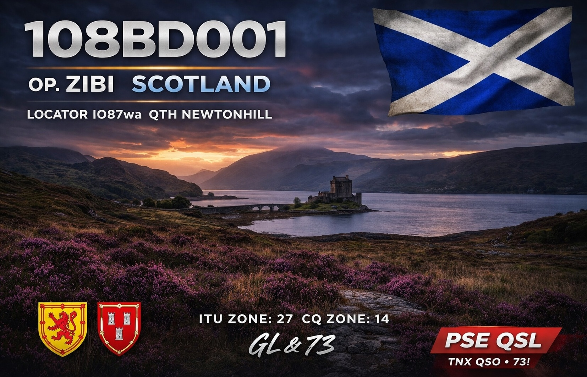

<!DOCTYPE html>
<html lang="en">
<head>
<meta charset="UTF-8">
<title>108BD001</title>

</head>

<body>

<!-- QSL IMAGE -->

<!-- TITLE -->
<h1>108BD001</h1>

OP. Zibi | Scotland

<!-- BUTTON -->
<a href="qsl.jpg" download class="button">
DOWNLOAD QSL CARD
</a>

<!-- ABOUT -->

    <h2>About</h2>
    
CB Radio operator from Scotland. Active on 27.555 USB.

<!-- QSO LOG -->

    <h2>QSO Log</h2>
    <table>
        <tr>
            <th>Date</th>
            <th>Station</th>
            <th>Mode</th>
        </tr>
        <tr>
            <td>22/03/2026</td>
            <td>John UK</td>
            <td>USB</td>
        </tr>
    </table>

</body>
</html>
